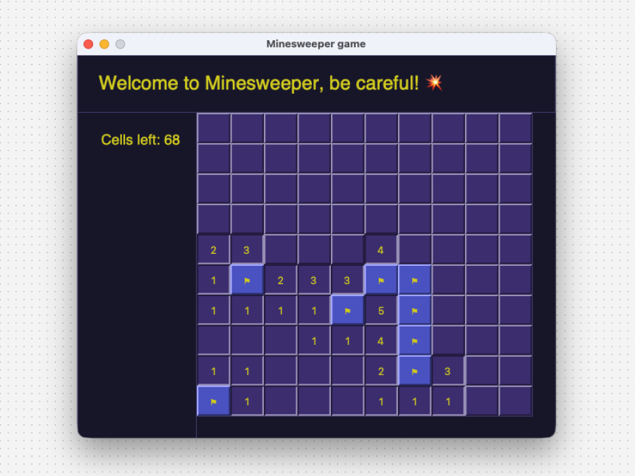
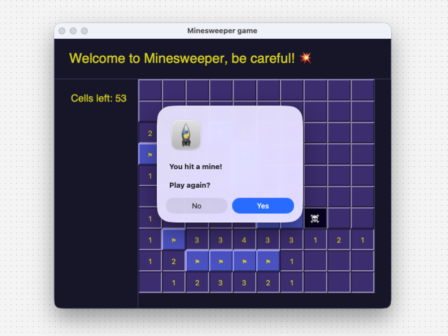

# Minesweeper

A local Minesweeper clone built with Python and tkinter, used as a hands-on exercise in OOP design.


## Overview

I decided to build this game clone as part nostalgia-trip and part a deliberate OOP practice project. The goal was to move from procedural logic to using classes and their methods, properties and encapsulation logic - and using them on a real fun example (rather than Car which can start() and is "red" :)).
Tkinter was chosen to keep the focus on structure/logic/learning over tooling (but looking forward to exploring pygame!)





## Getting started

**Requires:** Python 3.10+
```bash
git clone https://github.com/gre-ni/minesweeper.git
cd minesweeper
python main.py
```

No dependencies outside the standard library.


## How it's structured
 `cell.py` : `Cell` class — state (hidden, revealed, flagged), neighbour logic, click handlers, mine/win callbacks

 `main.py` : Window and frame setup, `start_game()` loop, game-over handler — procedural 
 
 `settings.py` : Constants — grid size, mine count, difficulty + design system variables 
 
 `utils.py` : Layout helpers — percentage-based width/height calculations 

`Cell` bundles both game logic and tkinter rendering: it owns the
`Label` widget, handles left/right click events, and fires the
win/loss callback registered by `main.py`.


## What I learned

- A more modular approach when I'm planning and writing code: Splitting the game mechanic into smaller interactions + being mindful of future adjustment. For example, I realised I need to account for adjusting game difficulty or grid size in the future.
- Similarly, I made my life a lot easier by eventually storing all colour and size constants in `settings.py` once mechanics were done and I started tinkering with design.
- Tkinter's event model was also an interesting find (I didn't know upfront whether I'd need to write my own event loop) -> Here, finding out what is handled by the OS was a good introduction to how GUI frameworks abstract (compared to lower-level systems like Xlib)


## What I'd change next time

- Replace the linear list search logic in populating cells -> Since the grid layout is really obvious, a 2d list or similar structure would immediately make much more sense for indexing and getting O(1) speed instead of O(n). For this small size, it was an ok solution, but for larger grids it could present problems.
- Add `pytest` coverage and make sure that logic is completely decoupled.
- Introduce a difficulty config (beginner / intermediate / expert).
